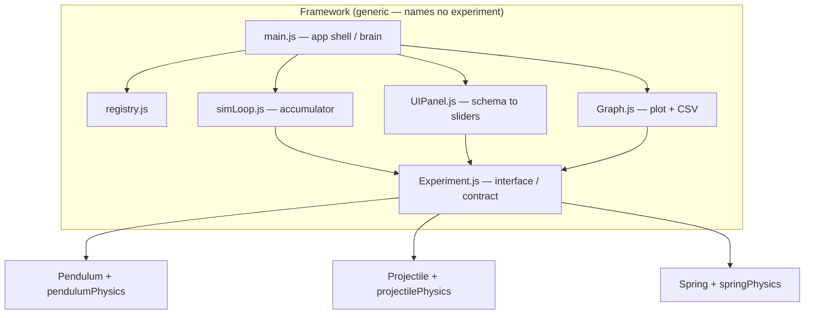

# ThreeJs-Physics-Lab 
## How to run

Requires Node.js (v18+).

npm install       # install dependencies
npm run dev       # start the dev server, then open the printed localhost URL
npm test          # run the physics + framework unit tests
npm run build     # produce a production build

Target: recent Chrome or Firefox on desktop.

## Architecture

### Shared Framework and Interface Pattern

Experiments (which must implement the Experiment.js contract) can be added and interchanged at a moment's notice.

By implementing the Experiment.js contract, the framework (sim loop, UI panel, graph, registry) can access the experiments through the contract ONLY — it never knows or cares which specific experiment is running.

Because no framework file references any specific experiment, a new experiment — including one added later by an AI agent working only from this repository — drops in without modifying any framework file.

## Architecture Diagram

**Adding an experiment — 3 total changes:**
1. Add an experiment file
2. Add the experiment's physics file
3. Add the experiment to the registry

This makes the framework extremely extensible and easy to build on.

### Physics and Renderer Decoupling

As stated, each experiment requires a physics file. This is because the physics file is pure, unit-testable, and free of three.js modules.

The experiment file uses the physics file's outputs and applies them to the meshes — a one-directional flow (physics never reaches into rendering).

The physics operate on a fixed-timestep accumulator to make them frame-rate independent and accurate on any device.

### Integrator Justification

The physics uses semi-implicit (symplectic) Euler because it conserves energy well. Explicit Euler, by contrast, injects energy into oscillators every step — the amplitude grows over time and the system gains energy from nowhere, which is physically impossible and would make the pendulum and spring swing progressively higher. Semi-implicit Euler avoids this for the same computational cost, by updating velocity first and then position using the new velocity.

(With damping enabled, energy legitimately decreases — that is real physics. The point is that the integrator does not *spuriously* add energy.)

### Schema-Driven UI

The UI is completely decoupled from experiments and generates itself from each experiment's schema. This means there is no per-experiment UI, which reinforces the modular approach.

## Dependencies

- **three** — required 3D rendering engine (mandated by the brief).
- **vitest** — test runner for the pure physics and framework unit tests.
- **happy-dom** — lightweight headless DOM, used only in tests to verify the UI panel and graph without a real browser (dev dependency, not shipped).

## Known Limitations

- The period/frequency comparison is logged to console, not shown in-UI (no generic scalar-readout component yet).
- The graph's point history grows unbounded over long runs (no rolling window / downsampling).
- Fixed canvas/viewport sizes, no window-resize handling.
- Extreme slider values can push objects out of the camera frame.
- Zero-crossing period measurement uses linear interpolation between steps.

## What I'd Do Next

Natural extensions, postponed due to the timeline:

- A generic scalar-readout UI panel to surface period/frequency/range on-screen (would remove the console.log limitation).
- The bonus features if not done: energy conservation plot, comparison mode, experiment switcher with dispose.
- Rolling-window graph for long runs.
- RK4 integrator option for higher accuracy where needed.